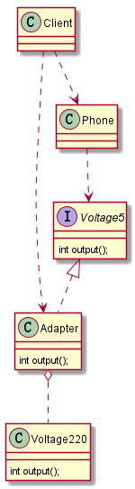
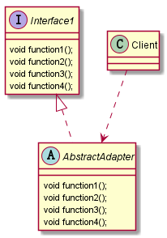

## 适配器模式

#### 适配器模式基本介绍

1.适配器模式用于让原本因接口不匹配不能一起工作的两个类可以协同工作。
2.适配器模式属于结构型模式
3.主要分为三类：类适配器模式、对象适配器模式、接口适配器模式

#### 类适配器场景说明

现在有一个场景如下，手机充电，但是手机仅支持5V的直流电（Voltage5），
而我国提供的是220V的交流电(Voltage220)，这时就需要有一个适配器（Adapter)将220V转换成5V
提供给手机充电

#### 类适配器结构图如下

#### 接口适配器模式介绍

1.一些书籍称之为：适配器模式或缺省适配器模式

2.当不需要全部实现接口提供的方法时，可先设计一个抽象类实现接口，
并为该接口中每一个方法提供一个默认实现（空方法),那么该抽象类的子类
可有选择的覆盖父类的某些方法来实现需求

3.适用于一个接口不想适用其所有的方法的情况

#### 接口适配器模式类图如下

