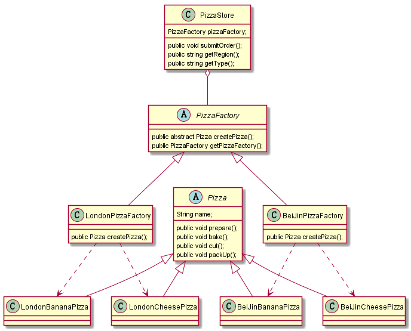

### 工程方法模式

#### 场景

有一个披萨项目：要便于披萨种类扩展、便于维护

1.披萨种类很多（比如GreekPizz、CheesePizz等)

2.披萨的制作流程:prepare(材料准备)，bake(烘烤)，cut(切割)、packUp(打包)

3.披萨店下单功能

在披萨项目的基础上，我们新增以下需求

1.客户在点披萨时，可以点不同地方，不同口味的披萨，比如北京的奶酪披萨
北京的香蕉披萨，伦敦的奶酪披萨，伦敦的香蕉披萨

#### 思考

如果我们对新增的需求，继续使用简单工程模式，可以想象的到，每新增一个地区
就要为该地区创建独立的工厂类，比如BeiJingSimpleFactory,LondonSimpleFactory,
可扩展性并不是特别好

这时，我们就可以使用工厂方法模式

#### 工厂方法模式

定义了一个创建对象的抽象方法，由子类决定要实例化的具体类。
工厂方法模式将对象的实例化推迟到子类

#### 类图结构如下

