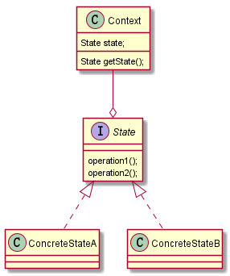

## 状态模式Demo

### 现有如下场景
1.假如每参加一次这个活动要扣除用户50积分，中奖概率为10%

2.奖品数量固定，抽完就不能抽奖

3.活动有四个状态：可以抽奖、不能抽奖、发放奖品和奖品领完

4.活动的四个状态转换关系图

### 问题分析：
这类代码，在添加一种状态时，我们需要手动添加if/else，在添加一种功能时，
要对所有的状态进行判断。因此代码会变得越来越臃肿，并且一旦没有处理某个状态
，便会发生及其严重的BUG,难以维护

### 状态模式(StatePattern)

1.它主要用来解决对象在多种状态转换时，需要对外输出不同的行为的问题。状态和行为是
一一对应的，状态之间可以相互转换

2.当一个对象的内在状态改变时，允许改变其行为，这个对象看起来像是改变了其类

### 类图说明

1.Context类为环境角色，用于维护State实例，这个实例定义当前状态

2.State是抽象状态角色

3.ConcreteState是具体的状态角色，每个子类实现一个与Context的一个状态相关的行为

